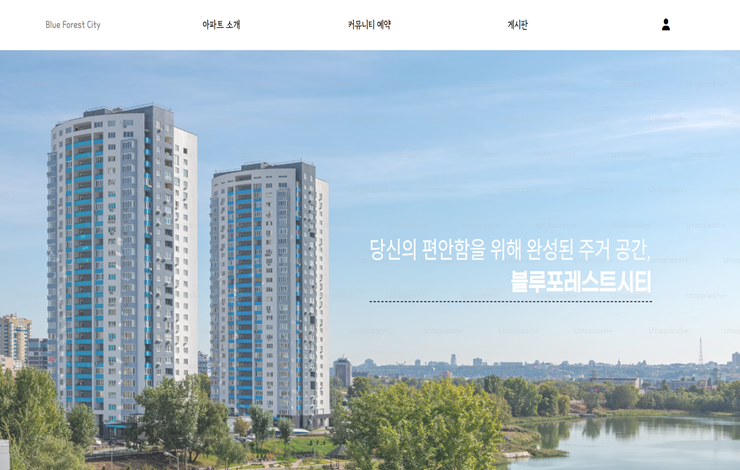

<h2>[Recoa]_Resident-Communication-Apartment</h2>

## 📋 목차
- [프로젝트 소개](#프로젝트-소개)
- [시작 가이드](#시작-가이드)
- [화면 구성](#화면-구성)
- [주요 기능](#주요-기능)
- [상세 기능](#상세-기능)

### 프로젝트 소개

#### (1) 소개 
- Recoa는 대단지 아파트 주민들의 보다 편리한 생활과 주민 간의 높은 유대감을 위한 플랫폼입니다.
- 독서실과 게스트 하우스 예약 기능을 제공하며 공지 게시판과 자유 게시판을 통해 주민들이 소통할 수 있는 공간을 마련했습니다.
- 다른 주민들과 관리자에게 쪽지나 채팅으로 쉽게 연락할 수 있고 고지서 확인 또한 가능합니다.
- 편리하고 유용한 기능들이 가득한 이 사이트에서 주민들이 함께 소통해보세요!

#### (2) 개발 기간 
2024.07 ~ 2024.10 (약 2.5개월)

#### (3) 팀원 구성
| 손민정 | 권예빈 |
| --- | --- |
| ||
| [sohnminjeong](https://github.com/sohnminjeong) | [gwon428](https://github.com/gwon428) |

#### (3_1) 역할 분담
##### 🍎 손민정
- **UI**
    - 페이지 : 로그인, 회원가입, 회원 마이 페이지, 관리자 페이지, 자유 게시판, 쪽지, 채팅
    - 공통 컴포넌트 : 상단 메뉴, 회원 쪽지&채팅&알림 탭
- **기능**
    - Spring Security 활용 _ 로그인 및 로그아웃, 회원가입 및 탈퇴, 아이디 및 비밀번호 찾기, 회원 정보 수정, 비밀번호 암호화
    - 자유 게시판 CRUD, 댓글 CRD, 좋아요 기능
    - 쪽지 CRD
    - WebSocket 활용 _ 1:1 채팅, 게시판 댓글&쪽지&채팅 알림
  
##### 🐶 권예빈
- **UI**
    - 페이지 : 메인 화면, ...
- **기능**
    - 공지 게시판, 독서실 예약, 게스트하우스 예약, 결제, ...

#### (4) Stacks 🧰
|||
|---|---|
|운영체제|Windows|
|사용언어|Java, JavaScript, HTML, CSS|
|FrameWork 및 Library|Spring, MyBatis, Security, Lombok, JSTL, Jackson, jQuery|
|DB|MySQL|
|Tool|JSP, STS(Spring Tool Suite)|
|WAS|Apache-Tomcat|
|Collaboration|Notion, Github, GoogleSheet|

### 시작 가이드

<h4>(1) Requirements</h4>
<h4>(2) Installation</h4>

### 화면 구성

### 주요 기능

### 상세 기능

